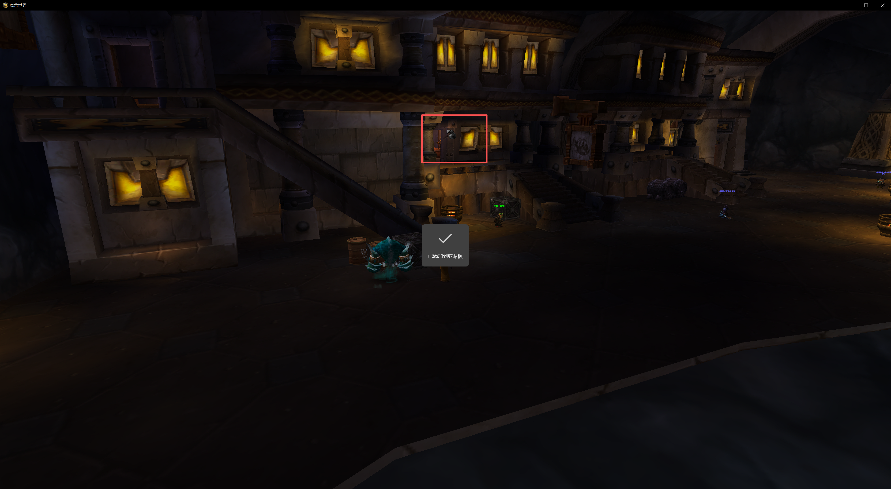
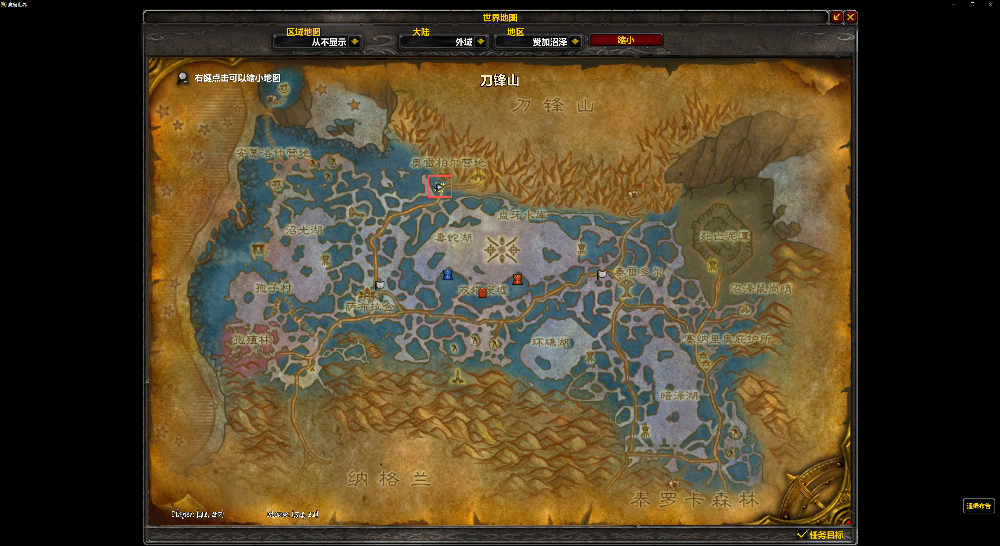

# 冲等级攻略

| 熟练度     | 食谱      | 购买材料     | 数量    | 金额（金） | 学习方式      | 联盟方配方售卖地点       | 钓鱼地点（推荐区域）   | 主要鱼群/刷新位置                  |
|:--------|:--------|:---------|:------|:------|:----------|:----------------|:-------------|:---------------------------|
| 1-40    | 香料面包    | 面粉+甜香料   | 40+40 | 0.19  | NPC       | 各大主城烹饪训练师       | 无需钓鱼         | -                          |
| 35-50   | 美味小鱼    | 新鲜的美味小鱼  | 15    | 1     | 拍卖行/1.3g  | 各大主城钓鱼NPC       | 新手区域河流、湖泊    | 艾尔文森林、杜隆塔尔、丹莫罗等低级水域        |
| 50-125  | 长嘴泥鳅    | 新鲜的长嘴泥鳅  | 160   | 18.4  | 拍卖行/1.5g  | 各大主城钓鱼NPC       | 10-30级区域河流湖泊 | 洛克莫丹、银松森林、贫瘠之地、黑海岸         |
| 125-160 | 刺须鲶鱼    | 新鲜的刺须鲶鱼  | 40    | 25    | 拍卖行/5g    | 各大主城钓鱼NPC       | 中高级淡水区域      | 荆棘谷、希尔斯布莱德丘陵、湿地            |
| 160-175 | 地精芥末蘸蚌肉 | 有腥味的蚌肉   | 20    | 20    | NPC       | 各大主城烹饪训练师       | 海岸打蚌获得       | 荆棘谷海岸、湿地海岸、凄凉之地海岸          |
| 175-225 | 石鳞鳕鱼    | 新鲜的石鳞鳕鱼  | 100   | 20    | 拍卖行/3.1g  | 荆棘谷-藏宝海湾-凯尔希·杨斯 | 海岸区域         | 荆棘谷藏宝海湾附近海域、菲拉斯海岸          |
| 225-270 | 油炸红腮鱼   | 新鲜的红腮鱼   | 60    | 9     | 拍卖行/10.5g | 荆棘谷-藏宝海湾-凯尔希·杨斯 | 内陆湖泊、河流      | 菲拉斯、辛特兰、艾萨拉水域              |
| 270-285 | 夜鳞鱼汤    | 新鲜的夜鳞鲷鱼  | 20    | 9     | 拍卖行/5g    | 塔纳利斯-热砂港-吉科希斯   | 夜晚钓鱼限定       | 菲拉斯、艾萨拉、塔纳利斯海岸（夜间）         |
| 285-300 | 烤鲑鱼     | 新鲜的白鳞鲑鱼  | 15    | 13    | 拍卖行/5.4g  | 菲拉斯-羽月要塞-薇薇安娜   | 高等级淡水区域      | 菲拉斯河流、东瘟疫之地水域              |
| 300-330 | 美味魔尾鱼   | 斑点魔尾鱼    | 30    | 11    | 拍卖行/10g   | 赞加沼泽，联盟商人祖莱     | 外域水域         | **赞加沼泽（首选）、泰罗卡森林**；优先钓魔尾鱼群 |
| 330-350 | 烤泥鱼     | 菲格鲁泥鱼    | 25    | 18    | 拍卖行/10g   | 纳格兰，联盟商人        | 纳格兰湖泊        | **纳格兰元素王座附近、天歌湖、湖中心鱼群**    |
| 350-400 | 烤鳐鱼     | 帝王鳐      | 100   | 3.5   | NPC/1.8g  | 达拉然-烹饪训练师       | 外域海域         | **泰罗卡森林、赞加沼泽、纳格兰水域**；帝王鳐鱼群 |
| 400-415 | 黑肉冻     | 北风水母     | 60    | 11    | NPC/4.5g  | 达拉然-烹饪训练师       | 诺森德海域        | **北风苔原、嚎风峡湾海岸**；北风水母群      |
| 415-450 | 帝王鳐鱼片   | 帝王鳐+北地香料 | 50+50 | 40    | 日常奖状3个    | 达拉然/冰冠冰川，联盟专属商人 | 诺森德海域        | **北风苔原、嚎风峡湾、龙骨荒野海岸**；帝王鳐鱼群 |


```text


新鲜的美味小鱼 15
新鲜的长嘴泥鳅 160
新鲜的刺须鲶鱼 40
有腥味的蚌肉 20
新鲜的石鳞鳕鱼 100
新鲜的红腮鱼 60
新鲜的夜鳞鲷鱼 20
新鲜的白鳞鲑鱼 15
斑点魔尾鱼 30
菲格鲁泥鱼 25
帝王鳐 150
北风水母 60


```

```text


EASYAUCTION_SHOPPING_LIST|1
LISTest
ITEM|5504|30
ITEM|6289|210
ITEM|6291|20
ITEM|6308|60
ITEM|6362|130
ITEM|13758|80
ITEM|13759|30
ITEM|13889|20
ITEM|27425|40
ITEM|27435|40
ITEM|41802|200
ITEM|41805|80


```

---

## 刺须鲶鱼 125-160




---

## 石鳞鳕鱼 175-225 & 油炸红腮鱼 225-270


---

## 夜鳞鱼汤 270-285


---

## 烤鲑鱼 285-300


---

## 美味魔尾鱼 300-330




---

## 烤泥鱼 330-350


---
